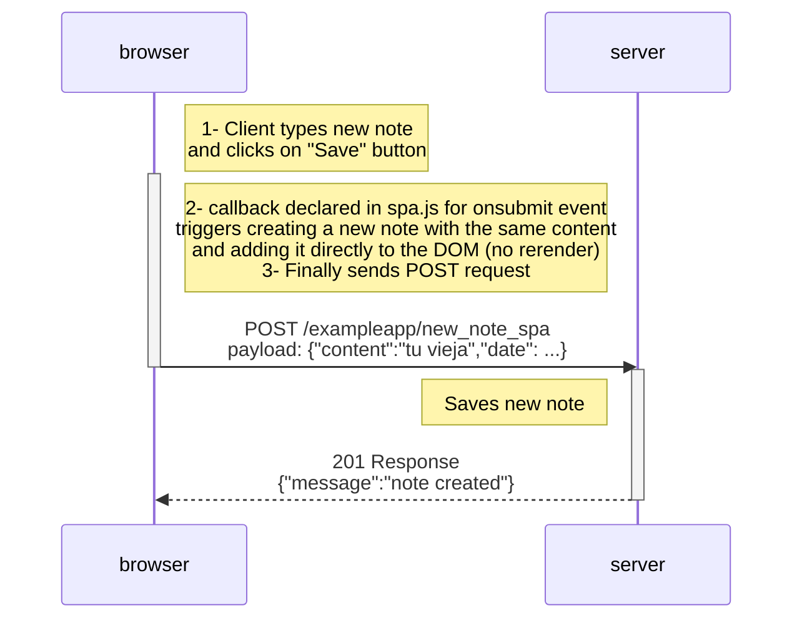

0.6: New note in Single page app diagram

Note: URLs are simplified showing the relevant part only (Method and directory inside server)

```mermaid
sequenceDiagram
participant browser
participant server

    Note right of browser: 1- Client types new note <br> and clicks on "Save" button
    activate browser
    Note right of browser: 2- callback declared in spa.js for onsubmit event<br>  triggers creating a new note with the same content <br> and adding it directly to the DOM (no rerender) <br> 3- Finally sends POST request
    browser->>server: POST /exampleapp/new_note_spa <br> payload: {"content":"tu vieja","date": ...}
    deactivate browser

    activate server
    Note left of server: Saves new note

    server-->>browser: 201 Response <br> {"message":"note created"}
    deactivate server


```
